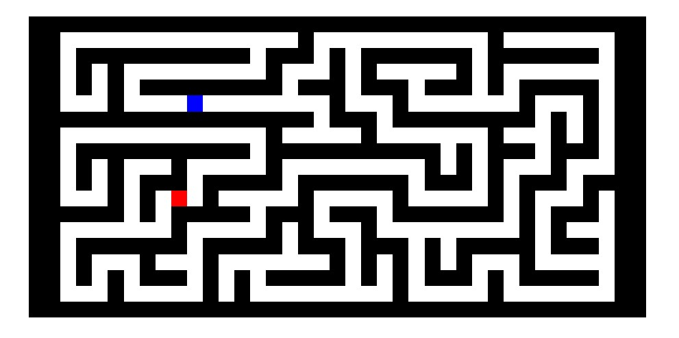

# Maze Generator
A small Python program that generates a maze. 
See <a href="MazeGenerator.py" target="_blank">here</a> .
 
 
 
Given the maze. It is now possible to add additional algortihms 
that can find a way from the blue start to the red ending.

